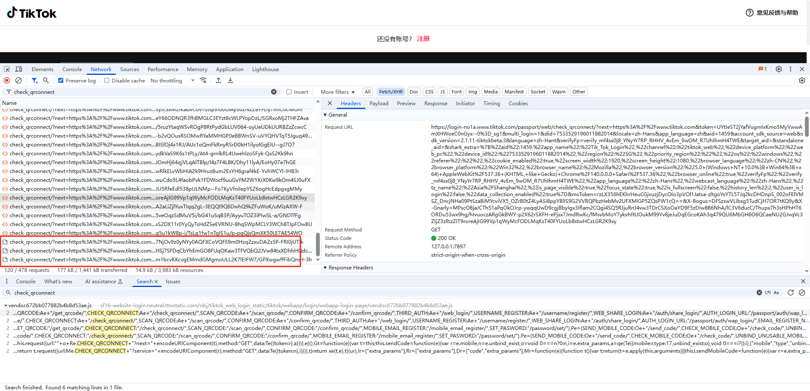
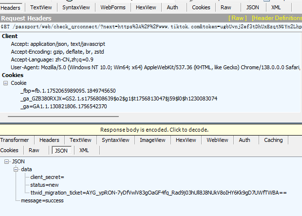
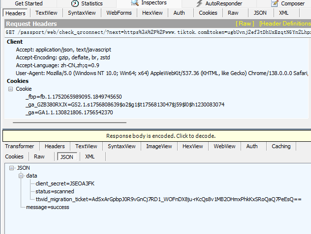
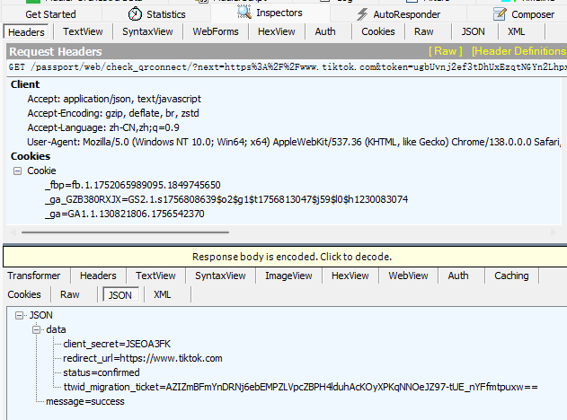
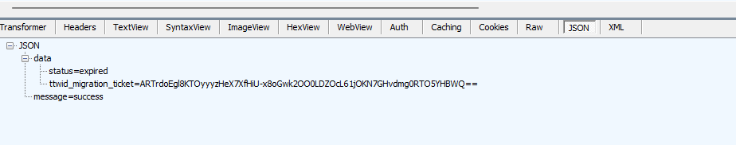
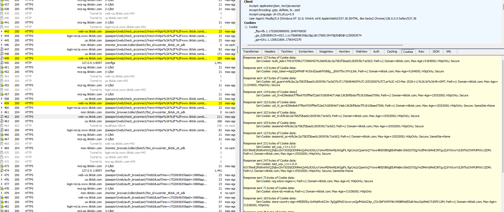

# 扫码登陆

获取接口二维码数据
TIKTOK_QR_LOGIN_URL = "https://www.tiktok.com/login/qrcode"

[tiktok_qrcode.py](tiktok_qrcode.py)
接口获取验证码数据流

获取的check接口为

https://web-va.tiktok.com/passport/web/check_qrconnect/
https://us.tiktok.com/passport/web/check_qrconnect/
https://login-no1a.www.tiktok.com/passport/web/check_qrconnect

# 验证服务器，可以看到验证服务器，同时在验证三个后端接口 ，且携带了很多加密参数涉及到

# 抓包三个接口 获取三个接口check验证的状态 只有一个接口会变化

https://web-va.tiktok.com/passport/web/check_qrconnect/
> 默认状态是 status = new

> 扫码成功的状态 status=scanned

> 扫码登录成功 status=confirmed

> 扫码过期 status=expired

# 验证通过的 confirmed Respose

> 服务器返回check的状态是 status=confirmed 返回有效Cookies信息，完成登录
``
Set-Cookie: multi_sids=7451070962772968453%3Abfe2ec2a7582f2bae0c265939c71e5d3; Path=/; Domain=tiktok.com; Max-Age=5184000; HttpOnly; Secure
Set-Cookie: cmpl_token=AgQQAPMdF-RO0rdZazekfV088g__BX6Yf5w3YN1L8A; Path=/; Domain=tiktok.com; Max-Age=5184000; HttpOnly; Secure
Set-Cookie: sid_guard=bfe2ec2a7582f2bae0c265939c71e5d3%7C1756984609%7C15552000%7CTue%2C+03-Mar-2026+11%3A16%3A49+GMT; Path=/; Domain=tiktok.com; Max-Age=31104000; HttpOnly; Secure
Set-Cookie: uid_tt=829ededcf7f6e9705ff9ef22e67c08584d714ab1363bf0bda7f518108aed7596; Path=/; Domain=tiktok.com; Max-Age=15552000; HttpOnly; Secure
Set-Cookie: uid_tt_ss=829ededcf7f6e9705ff9ef22e67c08584d714ab1363bf0bda7f518108aed7596; Path=/; Domain=tiktok.com; Max-Age=15552000; HttpOnly; Secure; SameSite=None
Set-Cookie: sid_tt=bfe2ec2a7582f2bae0c265939c71e5d3; Path=/; Domain=tiktok.com; Max-Age=15552000; HttpOnly; Secure
Set-Cookie: sessionid=bfe2ec2a7582f2bae0c265939c71e5d3; Path=/; Domain=tiktok.com; Max-Age=15552000; HttpOnly; Secure
Set-Cookie: sessionid_ss=bfe2ec2a7582f2bae0c265939c71e5d3; Path=/; Domain=tiktok.com; Max-Age=15552000; HttpOnly; Secure; SameSite=None
Set-Cookie: sid_ucp_v1=1.0.0-KGY5NmE2MzRmNWQ2NjkwZmY5ODljODhlMmQxMzJiOGUyYzAwMDNmMjUKGgiFiL7igrLhs2cQoerlxQYYsws4B0D0B0gEEAMaBm1hbGl2YSIgYmZlMmVjMmE3NTgyZjJiYWUwYzI2NTkzOWM3MWU1ZDM; Path=/; Domain=tiktok.com; Max-Age=15552000; HttpOnly; Secure
Set-Cookie: ssid_ucp_v1=1.0.0-KGY5NmE2MzRmNWQ2NjkwZmY5ODljODhlMmQxMzJiOGUyYzAwMDNmMjUKGgiFiL7igrLhs2cQoerlxQYYsws4B0D0B0gEEAMaBm1hbGl2YSIgYmZlMmVjMmE3NTgyZjJiYWUwYzI2NTkzOWM3MWU1ZDM; Path=/; Domain=tiktok.com; Max-Age=15552000; HttpOnly; Secure; SameSite=None
Set-Cookie: reg-store-region=; Path=/; Domain=tiktok.com; Max-Age=0; HttpOnly; Secure
Set-Cookie: store-country-sign=MEIEDEq-GnMqNhxKZJm-7gQgl0MzDJxwcryoQpfHGeGZAp_Cl2v0bFXXMYNKvMI8BMoEEIaR4zuUXptMeD7i1RPD12M; Path=/; Domain=tiktok.com; Max-Age=31536000; HttpOnly
Set-Cookie: store-country-code=ar; Path=/; Domain=tiktok.com; Max-Age=31536000; HttpOnly
Set-Cookie: store-country-code-src=uid; Path=/; Domain=tiktok.com; Max-Age=31536000; HttpOnly
Set-Cookie: tt-target-idc=useast1a; Path=/; Domain=tiktok.com; Max-Age=31536000; HttpOnly
Set-Cookie: tt-target-idc-sign=MSE0LsnzAWgKdDnAtZgvPpEFiU4h5MhNQ0WNRbJWycNmurNPfYRy5i9gJmri1JIeh0u_SWDRLSveCEfOSPHWpan9G0uxLCv4-iVk0JZfo3zt0ppBx1jgDNFF9z_0x6x1V5dVXN_xQcjeZs9ycjyoHiW4uVP4kXaahq_QEG5R6hC_aLIXvkrlTsHKojNBUl84GCUQTMHlow_SzRJPPENak22TasbMq4ZAGiPV8yWwSSR4Frxjo2c1_URrEqsAQ1_8kNI0FupyjC6tDkmg_vq4mRTnrmTv_gFJt2X6Wqal1u281k77VpVyHQXU7d0QOaeKipIBTfoJQ1Vo8PHfDsJaujnh5PduwjEAZvCm4u9vOjmyegmKb9rlpVENdeJ5MNKhEXRvy5VqVKs3tzQxL-zMg2QcTWig-PFV1GNslrVCvwdCjyKA98LduL-f_hpvZmwo7Y9otHiRbHc48D8-jj2TCQlOgZOG3hNryiGz3GfypehhXSXN_aVTBr1zsK4D90E1; Path=/; Domain=tiktok.com; Max-Age=31536000; HttpOnly
Set-Cookie: msToken=qHrtfnBX4mzuCvPaqSxSFlT439KDw6VxMzcV8nBxCFMUy_UURfDaKo9ZjC5l3SUm03BMwBO8LyLnrS6jxmtx13vBBEwQ04btiNtp5R8s7sDLfZcSZ8FM9VfbF6C12GpPF8bfLSuRz9l2x5H0bqd_Xnos; Path=/; Domain=tiktok.com; Expires=Sun, 14 Sep 2025 11:16:48 GMT; Secure; SameSite=None
``

# 同一二维码对比两次请求接口 ，主要不同参数为  msToken  X-Bogus X-Gnarly

